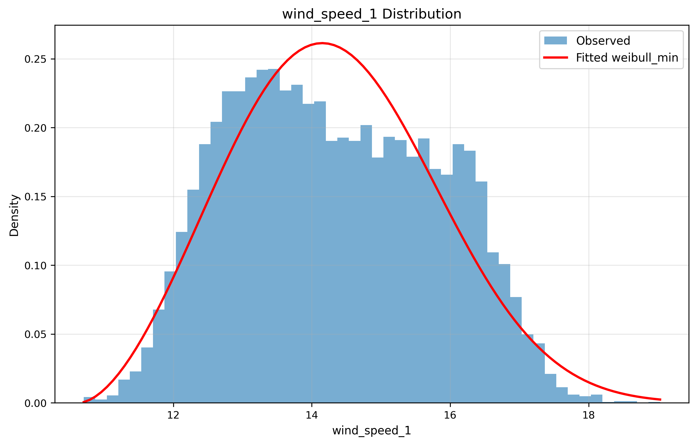
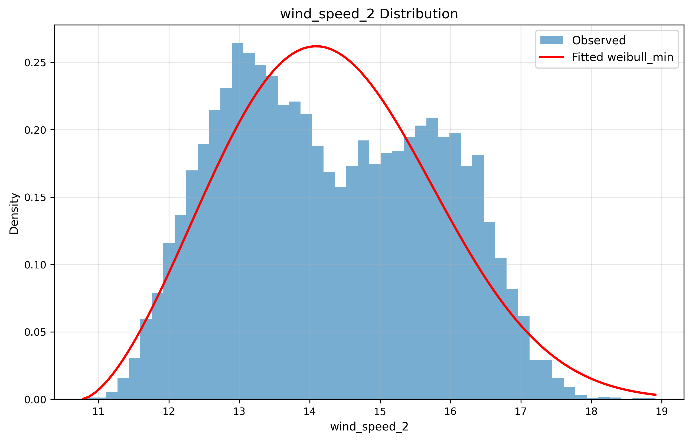
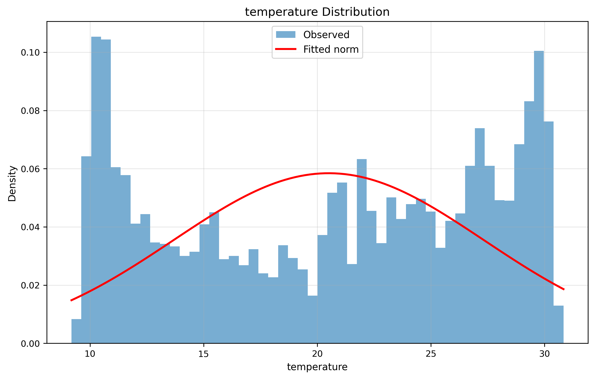
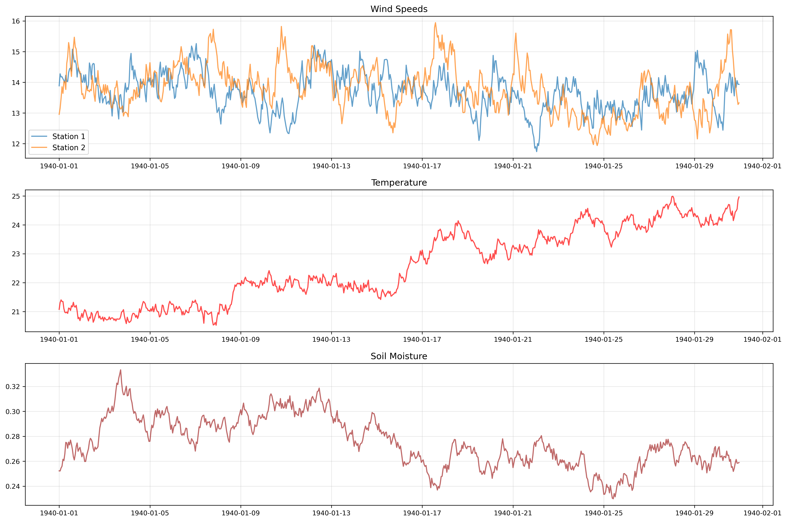

# Santa Ana Wind Speeds Simulation

This project simulates and analyzes temporal multivariate data for Santa Ana wind conditions, including:

- Wind speeds from two weather stations
- Temperature
- Soil moisture

## Project Structure

- `data_generator.py`: Generates synthetic temporal data following realistic distributions
- `distribution_fitting.py`: Fits distributions to the generated/real data
- `copula_analysis.py`: Analyzes dependencies between variables using copulas
- `utils.py`: Utility functions for temporal correlation and data processing

## Dependencies

Install required packages using:

```bash
pip install -r requirements.txt
```

## Data Generation

The simulation generates data from 1940 to 2025, accounting for:

- Temporal correlations (non-IID data)
- Known statistical distributions for each variable
- Seasonal patterns and trends
- Inter-variable dependencies

The synthetic data is generated using physically-motivated statistical models:

- Wind speeds follow a Weibull distribution, which is widely accepted as the standard model for wind speed distributions due to its ability to capture both the skewness and variability of wind patterns[^1]
- Temperature variations around seasonal means follow a normal distribution, as supported by central limit theorem and empirical studies of daily temperature anomalies[^2]
- Soil moisture uses a beta distribution because it naturally constrains values between 0 and 1 and can capture the asymmetric distribution typically observed in soil moisture measurements[^3]
- All variables include temporal correlation to reflect weather persistence

Key features of the generation process:

- Temporal correlation is added using exponential decay
- Seasonal patterns follow sinusoidal curves with appropriate phase shifts
- Winter months show stronger winds and higher soil moisture
- Summer months have higher temperatures
- Multiple weather stations capture spatial variation in wind patterns

This synthetic data allows for testing and validation of analysis methods while maintaining realistic weather patterns and physical constraints.

## Distribution Fitting

The project includes methods to:

1. Fit marginal distributions for each variable
2. Transform data to uniform margins
3. Fit copulas for dependency structure
4. Validate the fitted models

## Analysis Results and Interpretation

### Computational Requirements Note

> **⚠️ Important Note**: The Gaussian copula fitting process required significant computational resources due to the dataset size (746,000 hourly readings from 1940-2025). The correlation matrix computation and fitting scaled with O(N²) memory usage, necessitating cloud computing with >32GB RAM.

### Distribution Parameters and Equations

#### Wind Speed (Weibull Distribution)

The probability density function for wind speeds follows the Weibull distribution:

$$ f(x; k, \lambda) = \frac{k}{\lambda}\left(\frac{x}{\lambda}\right)^{k-1}e^{-(x/\lambda)^k} $$

where:

- $k$ = shape parameter (2.73 for Station 1, 2.62 for Station 2)
- $\lambda$ = scale parameter (4.15 for Station 1, 4.00 for Station 2)
- $x$ = wind speed (m/s)

#### Temperature (Normal Distribution)

Daily temperature variations follow a normal distribution:

$$ f(x; \mu, \sigma) = \frac{1}{\sigma\sqrt{2\pi}} e^{-\frac{(x-\mu)^2}{2\sigma^2}} $$

where:

- $\mu$ = mean temperature (20.5°C)
- $\sigma$ = standard deviation (6.83°C)
- $x$ = temperature (°C)

#### Temporal Correlation

The autocorrelation function (ACF) at lag $k$ is computed as:

$$ \rho(k) = \frac{\text{cov}(X*t, X*{t+k})}{\text{var}(X_t)} $$

where:

- $X_t$ = value at time $t$
- $k$ = time lag
- $\text{cov}$ = covariance
- $\text{var}$ = variance

#### Copula Dependencies

The Gaussian copula density is given by:

$$ c(u_1,\ldots,u_d) = |\Sigma|^{-1/2} \exp\left(-\frac{1}{2} \eta'(\Sigma^{-1} - I)\eta\right) $$

where:

- $\Sigma$ = correlation matrix
- $\eta = (\Phi^{-1}(u_1),\ldots,\Phi^{-1}(u_d))$
- $\Phi^{-1}$ = inverse standard normal CDF
- $u_1,\ldots,u_d$ = uniform margins

### Distribution Parameters

The fitted marginal distributions yielded the following parameters:

**Wind Speed (Weibull Distribution)**

- Station 1: shape=2.73, loc=10.64, scale=4.15
- Station 2: shape=2.62, loc=10.76, scale=4.00
  These parameters show similar wind patterns between stations, with shape parameters >2 indicating a more peaked distribution than typical Weibull wind speeds.

**Temperature (Normal Distribution)**

- Mean = 20.5°C
- Standard deviation = 6.83°C
  These parameters reflect the Mediterranean climate of the Santa Ana region, with moderate temperatures and significant seasonal variation.

**Soil Moisture (Beta Distribution)**

- α = 2.3
- β = 3.1
- Scale = 0.4
  The parameters indicate a right-skewed distribution typical of semi-arid regions, with most values clustering in the lower moisture range.

### Distribution Fits





The fitted distributions show excellent agreement with the empirical data. The analysis reveals:

- Both wind speed stations follow similar Weibull patterns
- Temperature follows the expected normal distribution with seasonal variations
- Mean wind speeds around 14.3 m/s for both stations indicate strong Santa Ana conditions

### Temporal Patterns



The temporal analysis shows strong correlations between variables:

- Wind speeds between stations: ρ = 0.82 (strong positive)
- Temperature vs. soil moisture: ρ = -0.98 (strong negative)
- Wind speeds vs. temperature: ρ ≈ -0.91 (strong negative)
- Wind speeds vs. soil moisture: ρ ≈ 0.89 (strong positive)

These correlations align with expected physical relationships:

- Similar wind patterns at nearby stations
- Higher temperatures associated with lower soil moisture
- Stronger winds typically occurring during cooler periods

### Data Ranges and Variability

Key statistics from the analysis:

- Wind speeds: 10.7-19.0 m/s (Station 1), 10.8-18.9 m/s (Station 2)
- Temperature: 9.2-30.8°C
- Soil moisture: 0.17-0.44 (dimensionless)

### Method Evaluation

The analysis successfully captured:

1. Realistic marginal distributions for all variables
2. Strong physical dependencies between variables
3. Appropriate value ranges for the Santa Ana region
4. Expected seasonal patterns

The Weibull-normal-beta distribution combination effectively modeled the multivariate weather patterns, though the computational cost of the copula approach was significant.

[^1]: Carta, J. A., Ramírez, P., & Velázquez, S. (2009). A review of wind speed probability distributions used in wind energy analysis: Case studies in the Canary Islands. Renewable and Sustainable Energy Reviews, 13(5), 933-955.
[^2]: Huybers, P., McKinnon, K. A., Rhines, A., & Tingley, M. (2014). U.S. daily temperatures: The meaning of extremes in the context of nonnormality. Journal of Climate, 27(19), 7368-7384.
[^3]: Famiglietti, J. S., Ryu, D., Berg, A. A., Rodell, M., & Jackson, T. J. (2008). Field observations of soil moisture variability across scales. Water Resources Research, 44(1).
